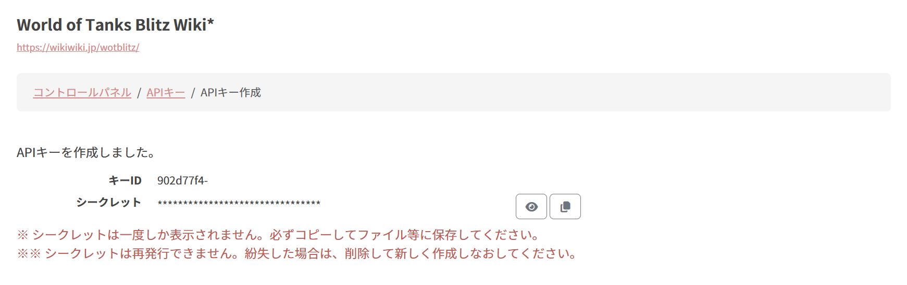
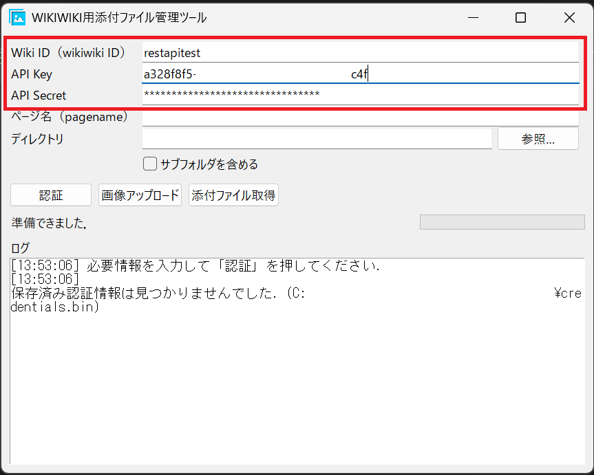
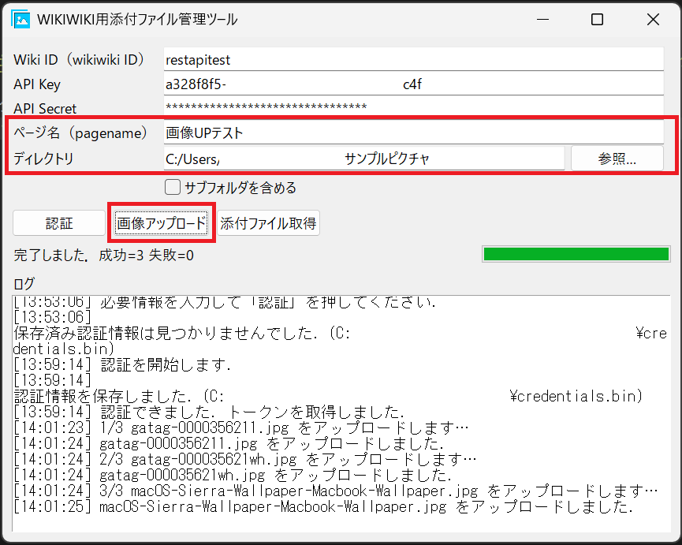
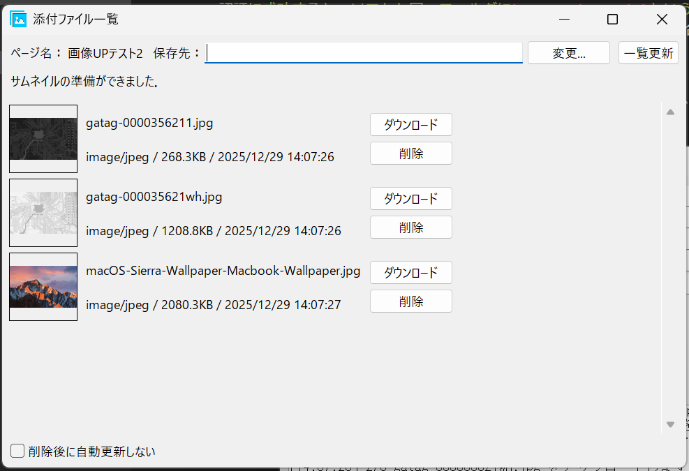

# wikiwiki.jp用添付ファイル(画像)管理ツール

wikiwiki.jpで運営されているwikiの添付ファイル(画像)を一括でアップロード・管理するためのデスクトップアプリケーションです。  
公式APIを利用しており、複数の画像をまとめてアップロードしたり、アップロード済みの画像を一覧表示・削除したりすることができます。

## できること

- 画像の一括アップロード
- 画像の一覧表示(サムネイル表示)
- 画像の削除

## 使い方

### 事前準備

wikiwiki.jpのコントロールパネルからAPIキー・シークレットキーを発行する必要があります。  
  
シークレットキーは発行時に1度しか表示されないため、何らかの形でメモしておくことをおすすめします。

### APIキーの認証

画像のアップロード、管理を行うには、はじめにAPIキーの認証を行う必要があります。  
ソフト起動後、各入力欄に操作対象のwiki名(URLのwikiwiki.jpに続く文字列)、発行したAPIキー、シークレットキーを入力し、`認証`ボタンをクリックしてください。  
  
認証に成功すると、画面下部のログ表示部分に「認証しました」と表示されます。

- APIキーやシークレットキーが間違っている場合はエラーが表示されます。
- 認証に成功すると、ソフトと同一フォルダに`credentials.bin`というファイルが生成され、入力内容を保存します。  
 また、ソフト起動時、同一フォルダに`credentials.bin`が存在する場合は入力内容を自動的に読み込みます。

### 画像のアップロード

`ページ名`に操作対象のページ名と、アップロードする画像の含まれたディレクトリを指定し、`画像アップロード`ボタンをクリックすると画像のアップロードが始まります。

- 存在しないページを指定した場合は、新規にページが作成されます。
- 既に同名のファイルが存在する場合はエラーとなります。(その画像のみアップロードをスキップするため、重複してアップロードすることはありません。)

### 画像の一覧表示・削除

`ページ名`に操作対象のページ名を指定し、`添付ファイル取得`ボタンをクリックすると、別ウィンドウにて指定したページに添付されている画像の一覧が表示されます。

- 添付された画像の枚数が多い場合、サムネイルの生成に時間がかかることがあります。
- 各画像の`削除`ボタンをクリックすると、画像が削除されます。  
 なお、削除後に再度画像の読み込みを行います。画像の枚数が多い、複数枚の画像を削除する等で読み込みに時間が掛かる場合は、`削除後に自動更新しない`チェックボックスをオンにしてください。
- 各画像の`ダウンロード`ボタンをクリックすると、画像をダウンロードできます。

## 動作環境

- Windows11 (ARM版の動作は未確認)

## その他

- APIの仕様変更等により動作しなくなる場合があります。
- ブラウザ上よりも容易に複数ファイルのアップロード・削除が可能です。編集に必要な複数のファイルを管理する目的のソフトウェアとして提供しています。wikiwiki.jpの利用規約に違反する行為には使用しないでください。また、APIキー・シークレットキーの管理には十分注意してください。
- 本ソフトウェアの利用により発生したいかなる損害についても、一切の責任を負いかねます。自己責任でご利用ください。

## 更新履歴

#### 1.0.1
- 新規公開

## ライセンス
© 2025 Chansei MIT License
